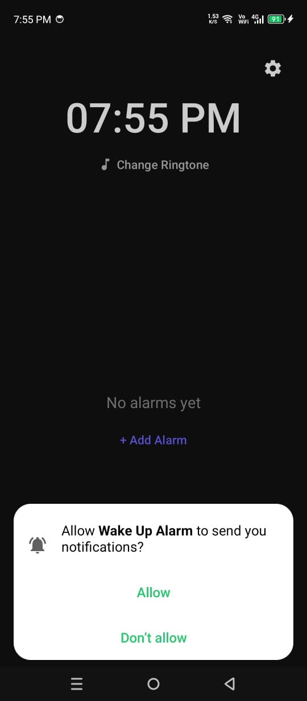
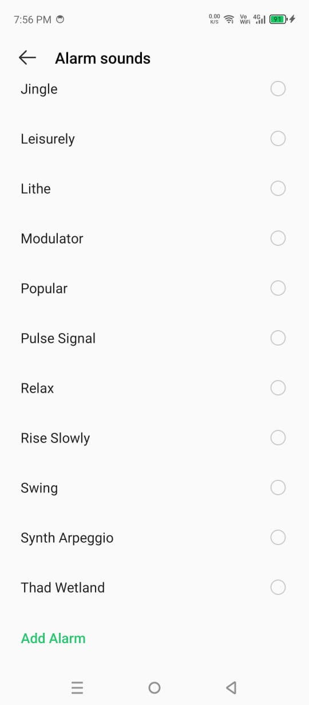
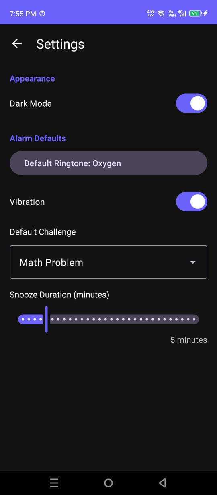
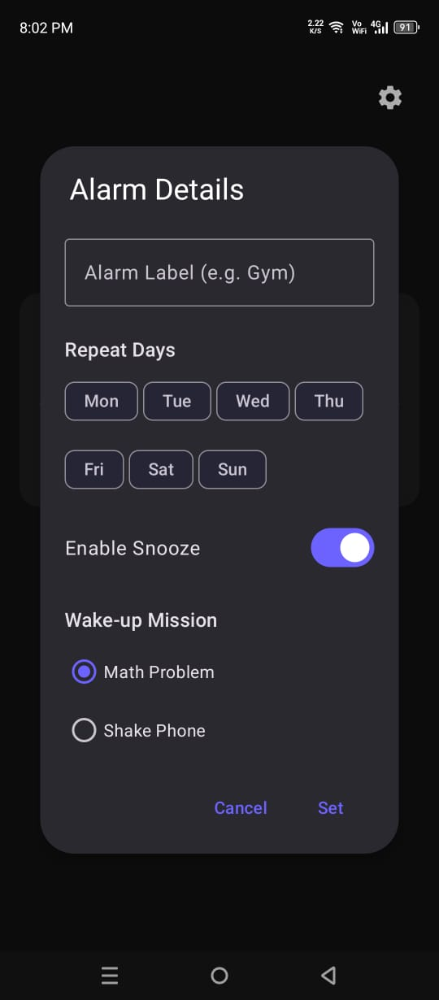
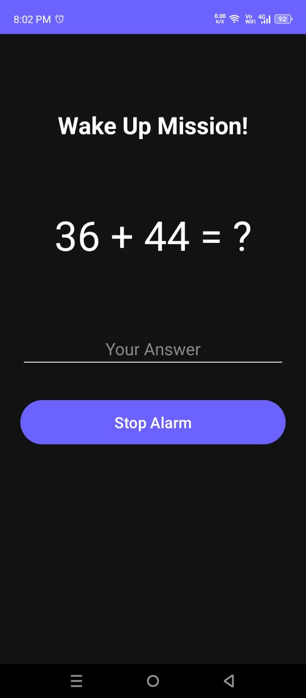
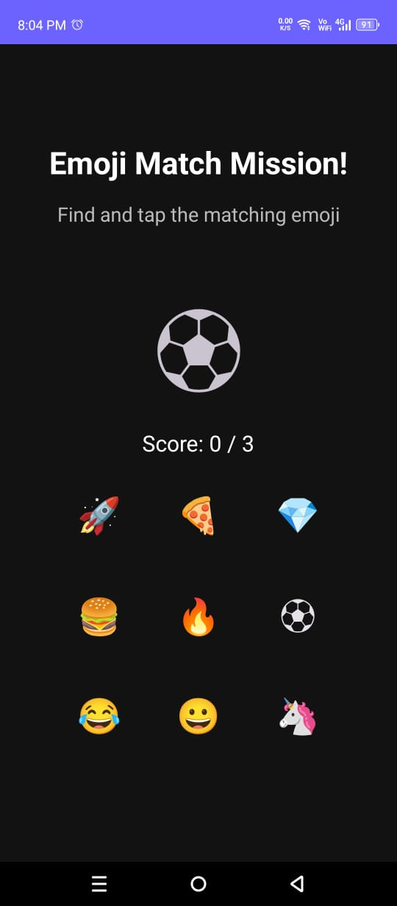
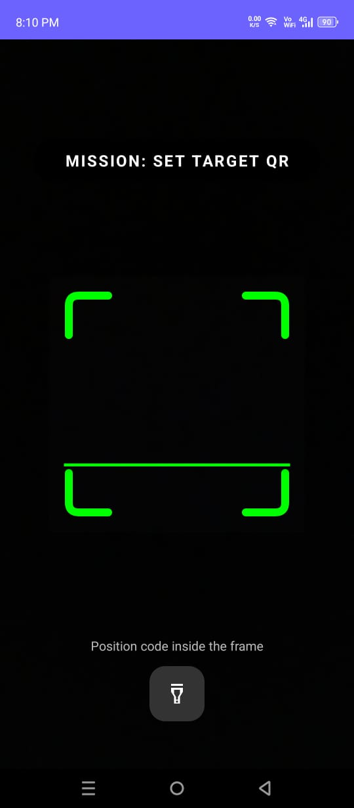
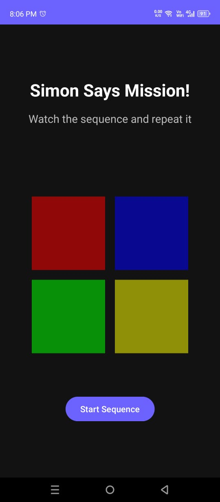
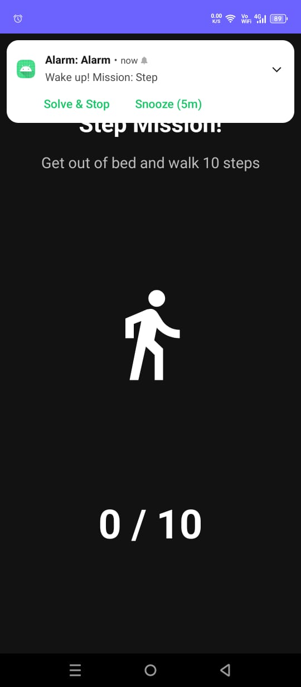
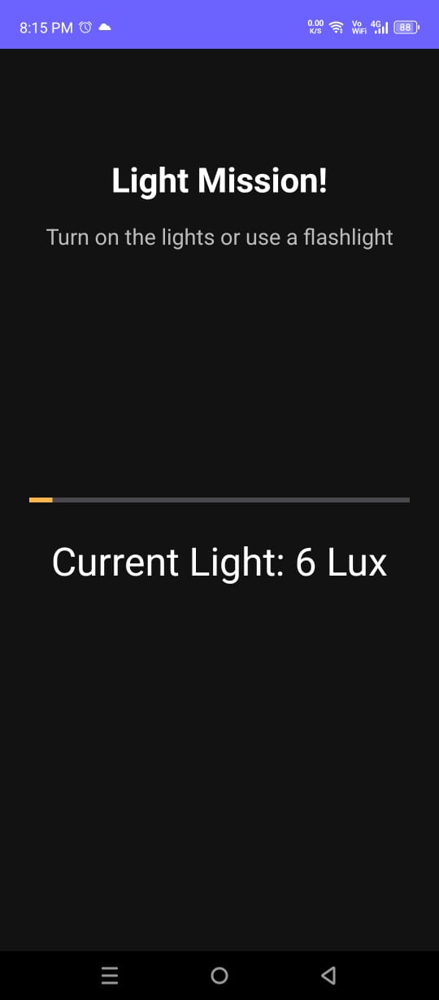

# ⏰ WakeQuest

> **Wake Up. Complete the Mission. Start Your Day.**

WakeQuest is a modern Android alarm clock application built with **Kotlin** and **Android Studio**. Unlike traditional alarm apps, WakeQuest requires users to complete interactive challenges before an alarm can be dismissed, making it much harder to oversleep.

---

# ✨ Features

## 📱 Smart Alarm Management

- Create multiple alarms
- Edit existing alarms
- Enable / Disable alarms
- Custom alarm labels
- Repeat alarms on selected weekdays
- Individual ringtone selection
- Snooze support
- Modern RecyclerView alarm list

---

## 🏠 Home Screen

- Live Digital Clock
- Beautiful Material 3 UI
- Quick Add Alarm (FAB)
- Empty State Screen
- Clean and responsive design

---

# 🧩 Wake-Up Missions

Complete a challenge before your alarm stops!

### ➕ Math Challenge
Solve random math problems.

### ⌨️ Typing Challenge
Type the displayed sentence correctly.

### 🎨 Stroop Test
Match the text color instead of the word.

### 😀 Emoji Match
Find the correct emoji from a grid.

### 🃏 Memory Cards
Match all card pairs.

### 🔢 Sort Numbers
Tap numbers in ascending order.

### 🎵 Simon Says
Repeat the color sequence correctly.

### 📱 Shake Mission
Shake your phone multiple times.

### 🎯 Catch the Button
Catch a moving button before time runs out.

### 👣 Step Counter Mission
Walk a specific number of steps.

### 💡 Light Mission
Turn on the room lights using the light sensor.

### 📷 QR Scanner Mission
Scan a predefined QR code using CameraX.

---

# ⚙️ Settings

- 🌙 Dark Mode
- 🔔 Default Ringtone
- 📳 Vibration Control
- 🎯 Default Wake-up Mission
- ⏱ Adjustable Snooze Duration

---

# 🛠 Technologies Used

- Kotlin
- Android Studio
- Material 3
- RecyclerView
- CameraX
- Accelerometer
- Step Counter Sensor
- Light Sensor
- QR Code Scanner
- AlarmManager
- BroadcastReceiver
- Services
- SharedPreferences

---

# 📸 Screenshots

| Home | Add Alarm |
|------|-----------|
|  |  |

| Settings | Alarm List |
|----------|------------|
|  |  |

| Math Mission | Emoji Mission |
|--------------|---------------|
|  |  |

| QR Scanner | Simon Says |
|------------|-------------|
|  |  |

| Step Mission | Light Mission |
|--------------|---------------|
|  |  |

---

# 🚀 Installation

1. Clone the repository

```bash
git clone https://github.com/shamtarar02-lgtm/WakeQuest.git
```

2. Open the project in Android Studio.

3. Sync Gradle.

4. Build and Run the application.

---

# 🎯 Project Highlights

✔ Interactive wake-up challenges

✔ Material 3 Design

✔ CameraX Integration

✔ Multiple Android Sensors

✔ Alarm Management System

✔ Dark Mode Support

✔ Modern Kotlin Architecture

---

# 👩‍💻 Developer

**Kinza Mukhtar**

IT Student | Android & Kotlin Developer

GitHub:
https://github.com/shamtarar02-lgtm

---

## ⭐ If you like this project, don't forget to give it a Star!
